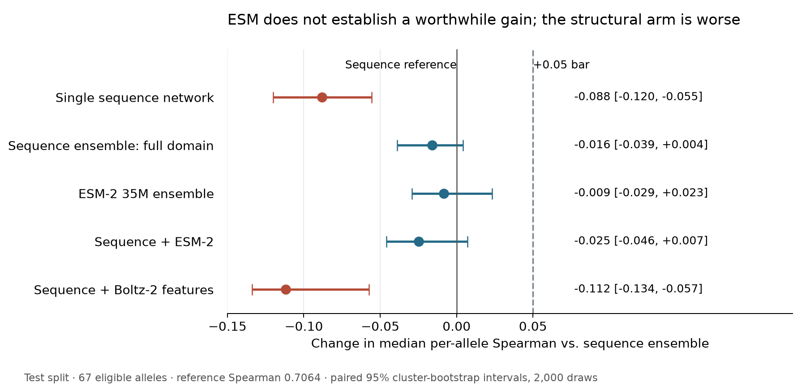
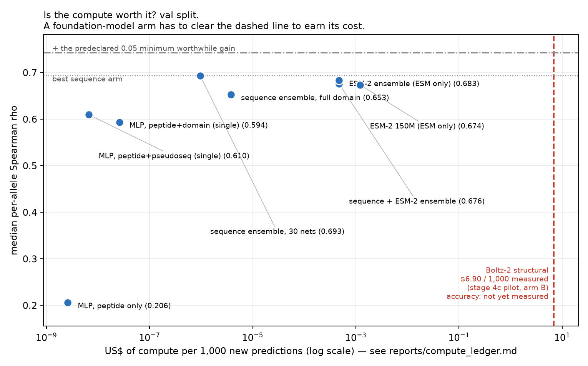

# Does a pretrained protein model earn its compute?

**Peptide–HLA stability prediction — London AI × Science, Protein Engineering
Track, 3–4 October 2026.**

Your cells constantly shred their own proteins and display the fragments on the
surface, held in a groove by an HLA molecule, so passing immune cells can check
what is being made inside. How *long* a fragment stays in that groove — its
**dissociation half-life** — is a large part of what makes it visible to the
immune system, and it is what a vaccine or cancer-neoantigen designer wants to
predict. We predict the half-life of a 9-residue peptide in a given HLA groove.

Pretrained protein models are the obvious thing to reach for. **We tested
whether they actually help here, against a predeclared bar, on a split that was
scored once.** They did not.

## The answer

- **A supervised sequence ensemble wins** — median per-allele Spearman
  **0.7064** on the held-out test split, from 30 small networks reading the
  peptide plus 34 HLA contact residues, trained on CPU in about a minute.
- **Frozen ESM-2 embeddings do not establish a gain.** ESM-2 35M lands at
  −0.009 [−0.029, +0.023]. The interval crosses zero, so the *direction* is
  unresolved — but its upper bound sits below the +0.05 we predeclared as
  worthwhile, so the gain we said we were looking for is excluded.
- **Boltz-2 structures made it worse** — −0.112 [−0.134, −0.057], interval
  entirely below zero, after folding all 28,166 complexes for **$212.71**. That
  arm cost roughly **7 million times** more per prediction than the winner —
  and lost.

The third one is the result we'd defend hardest: we spent the money, folded the
full cohort with zero failures, and the structural features still subtracted
accuracy. That is a measurement rather than an opinion — though it measures
*this* structural arm, whose sequence encoding also differs from the reference,
not structure-based prediction in general
([why that matters](reports/REPORT.md#3-main-result-validation-comparisons)).

## Test results

Scored once, 4 October 2026 at 13:35 BST. 5,565 rows across 67 eligible
alleles. All deltas are against the sequence ensemble, paired 95% intervals
from 2,000 whole-peptide-cluster resamples.

| Approach | Test Spearman | Δ vs. reference [95% CI] | Verdict |
|---|---:|---|---|
| **Sequence ensemble: peptide + contact residues** | **0.7064** | — | **reference** |
| ESM-2 35M ensemble | 0.6979 | −0.009 [−0.029, +0.023] | unresolved; excludes +0.05 |
| Sequence ensemble: full HLA domain | 0.6904 | −0.016 [−0.039, +0.004] | unresolved; excludes +0.05 |
| Sequence + ESM-2 ensemble | 0.6816 | −0.025 [−0.046, +0.007] | unresolved; excludes +0.05 |
| Single sequence network | 0.6181 | −0.088 [−0.120, −0.055] | worse |
| Sequence + Boltz-2 geometry + confidence | 0.5947 | −0.112 [−0.134, −0.057] | **worse** |

Validation agrees with test on every one of these verdicts — see
[§3 of the report](reports/REPORT.md#3-main-result-validation-comparisons).

## Why you can believe the numbers

This is the part we spent the most care on, because a negative result is only
worth reporting if the comparison is honest.

| Guard | What it does |
|---|---|
| **Frozen splits by peptide similarity** | Peptides within 3 substitutions are clustered and kept in the same split; minimum cross-split distance is 4. Without this, a model scores well by recognising near-copies of its training data. |
| **Predeclared bar** | +0.05 median Spearman, written into [EVALUATION.md](EVALUATION.md) at stage 1, before any model existed. We cannot move it after seeing results. |
| **Paired cluster bootstrap** | Intervals resample whole peptide clusters, not rows, so correlated near-duplicate peptides cannot narrow an interval. |
| **Test scored once** | One pass, six arms, [a runbook](reports/TEST_SCORING_RUNBOOK.md) fixed in advance and a [completion manifest](reports/stage6_test_manifest.json) with per-arm prediction hashes. |
| **Ensemble parity** | Every arm is 30 networks or none is. Ensembling alone is worth **+0.074** mean Spearman from no new information — comparing an ensembled ESM arm to a single sequence network would have manufactured a win. |
| **Disclosed contamination** | An early diagnostic re-partitioned the data and exposed 3,350 frozen test rows to fitting. We retracted its conclusion, refit the benchmark on the frozen training split, and [wrote down exactly what leaked](EVALUATION.md#disclosed-test-exposure) rather than quietly reusing the split. |

An interval crossing zero is reported as **inconclusive, not negative**.
NetMHCstabpan, the obvious external comparator, trained on our test peptides,
so it appears only as a calibration check and never as a baseline.

## Does the compute pay for itself?

| Arm | Cost per 1,000 new predictions | Project spend |
|---|---:|---:|
| Single sequence network | ~$6.6 × 10⁻⁹ | $0 |
| Sequence ensemble, 30 nets | ~$9.6 × 10⁻⁷ (0.073 s of CPU) | $0 |
| ESM-2 35M ensemble | ~$4.7 × 10⁻⁴ (1.14 s) | $0 |
| Boltz-2 structural | **≈$6.90** (fold only, ≈$7.55 at the realised cohort rate) | **$212.71** |

Accuracy varies by 0.11 Spearman across **nine orders of magnitude** of compute,
and the most expensive arm is the worst one. The $212.71 is **derived** —
realised container-hours × the measured $1.4812/h worker rate — not a reconciled
vendor bill, and we label it that way rather than rounding it into a claim. Full
accounting: [compute_ledger.md](reports/compute_ledger.md).

## The model does transfer — just not from the foundation models

The sequence ensemble, with **no retraining**, separates 81,600 naturally
presented peptides from 816,000 matched decoys across 51 alleles at median
**AUROC 0.9656**. Two controls make that meaningful: it holds at 0.9157 when
the decoys are real ligands from *other* alleles, and collapses to 0.6965 when
the model is handed the wrong HLA sequence. So it has learned allele-specific
recognition, not a generic "looks like a peptide" prior.

This is a different assay, not a second measurement of half-life accuracy.
Protocol and caveats: [stage 3c](reports/stage3c_elution_validation.md).

## What we did not establish

- Conclusions cover **frozen** ESM-2 embeddings and **single-pose** Boltz-2
  features. Fine-tuning, other model families and other structural
  representations are untested — this is a bounded negative, not a verdict on
  structure or on protein language models.
- ESM-2 × affinity multitask (stage 3b) is **unresolved**: we never established
  sensitivity at the +0.05 bar. Underpowered is not the same as null.
- ProteinMPNN and FoldX are diagnostic pilots. Neither was scored for half-life.
- 20.2% of labels sit at the assay floor, with no replicates to estimate a noise
  ceiling, and the allele panel was partly selected by predicted affinity.

Full register: [limitations.md](reports/limitations.md).

## Where to look

| | |
|---|---|
| **[reports/REPORT.md](reports/REPORT.md)** | **The write-up.** Every claim sourced to the stage report behind it. Start here. |
| [site/index.html](site/index.html) | One-page visual version, with the intro animation. |
| [EVALUATION.md](EVALUATION.md) | The evaluation contract, frozen at stage 1. |
| [reports/limitations.md](reports/limitations.md) | Everything to discount the result by. |
| [reports/compute_ledger.md](reports/compute_ledger.md) | Every dollar and GPU-hour. |
| [docs/DEVELOPMENT.md](docs/DEVELOPMENT.md) | Setup, reproduction commands, repo rules. |
| [HACKATHON_PLAN.md](HACKATHON_PLAN.md) | Scope and stage order. |

### Stage index

Validation unless a row says otherwise. Deltas use the sequence ensemble.

| Stage | Outcome | Report |
|---|---|---|
| 1 data audit + frozen splits | Alphabets, construct, zero-label pile-up, split design; evaluation contract frozen | [audit_summary](reports/audit_summary.md), [EVALUATION](EVALUATION.md) |
| 2 sequence baselines | Sequence ensemble **0.693**; single network 0.610; ensembling alone worth +0.074 mean SCC | [stage2_baselines](reports/stage2_baselines.md) |
| 2b weak-binder augmentation | No gain; best arm +0.024, all intervals cross zero and exclude +0.05 | [stage2b_augmentation](reports/stage2b_augmentation.md) |
| 2c auxiliary affinity labels | No gain; affinity alone ranks stability at ρ 0.580, below labels | [stage2c_affinity](reports/stage2c_affinity.md) |
| 3 frozen ESM-2 embeddings | No worthwhile gain; 35M 0.683 (−0.010), seq+ESM 0.676 (−0.017); both exclude +0.05 | [stage3_esm](reports/stage3_esm.md) |
| 3b ESM-2 × affinity | Unresolved; difference-in-differences power at the bar unestablished | [stage3b_esm_multitask](reports/stage3b_esm_multitask.md) |
| 3c elution transfer (sequence arm) | Median AUROC **0.9656** over 51 alleles; ESM-2/structural pass not run | [stage3c_elution_validation](reports/stage3c_elution_validation.md) |
| 3d ESM-2 likelihood features | **Not run** — stage 3 conclusion bounded to embeddings | — |
| 4a/4b GPU benchmark + two-chain pilot | A10 selected; three folding lessons carry forward | [stage4_benchmark](reports/stage4_benchmark.md) |
| 4b.1 groove MSA cache | All 75 alleles cached, 182-residue groove, $0 | [stage4b1_msa_cache](reports/stage4b1_msa_cache.md) |
| 4c ectodomain fold | Boltz-2 passed the pilot gate, ESMFold2 failed; production complete, 28,166 folds, **$212.71** | [stage4c_ectodomain_pilot](reports/stage4c_ectodomain_pilot.md) |
| 4c.5 structural features | Full pass complete, 28,166 rows, 0 failures, **109 numeric features**, ~$1.18 | [stage4c5_features](reports/stage4c5_features.md) |
| 5 inverse folding (ProteinMPNN) | Structural arm conclusively worse (test −0.112); pep log-likelihood is a pose-failure triage signal, not a predictor; QC sample run, full scoring declined | [stage5_inverse_folding](reports/stage5_inverse_folding.md) |
| 6 evaluation machinery + test scoring | Machinery exercised, then test scored once; test agrees with validation | [stage6_evaluation_machinery](reports/stage6_evaluation_machinery.md), [stage6_val_esm_run](reports/stage6_val_esm_run.md) |
| 7a censored (Tobit) loss | Conclusively worse ranking, Δ −0.0414 [−0.0780, −0.0062]; better floor calibration | [stage7_censored](reports/stage7_censored.md) |
| 7b leave-allele-out | Near 0.741 / distant 0.339, near − distant +0.403 [+0.223, +0.478]; separate contract, not comparable to frozen-split numbers | [stage7_allele_holdout](reports/stage7_allele_holdout.md) |
| 8 FoldX empirical energy | Pilot only; RepairPDB required; the arm was not scored for half-life | [stage8_foldx](reports/stage8_foldx.md) |

## Dataset

| Property | Value |
|---|---:|
| Peptide–HLA pairs | 28,166 |
| Unique 9-mer peptides | 5,633 |
| HLA alleles | 75 |
| Labels at 0 h (assay floor) | 20.2% |
| Train / validation / test rows | 19,716 / 2,817 / 5,633 |

Measured half-lives from Rasmussen et al.; see [docs/DATASETS.md](docs/DATASETS.md).

## Status

Project complete. The Boltz-2 production fold is done: 28,166 folds, 0
failures. Three items are genuinely open — provider-bill reconciliation of the
$212.71, the elution transfer pass on the ESM-2 and structural arms, and stage
3d ESM-2 likelihood features.

To run any of it: **[docs/DEVELOPMENT.md](docs/DEVELOPMENT.md)**.
