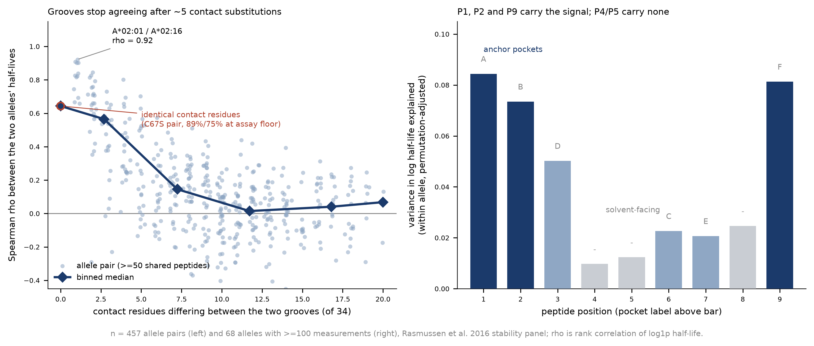

# What the data says about the biology, and what follows for the models

Everything below is measured on `data/rasmussen_et_al_dataset.csv` only — no split, no
model. Regenerate with `python scripts/biology_probes.py && python scripts/plot_biology.py`;
tables land in `reports/allele_pair_concordance.csv` and `reports/position_eta2.csv`.
Numbers quoted from stage 2 are marked as such.

---

## 1. Stability is a property of the complex, not of the peptide

457 allele pairs share at least 50 peptides. Ranking agreement between two alleles on the
peptides they share collapses with the number of differing contact residues:

| contact residues differing (of 34) | pairs | median ρ | IQR |
|---|---:|---:|---|
| 0 | 1 | 0.643 | — |
| 1–4 | 79 | 0.565 | 0.362–0.707 |
| 5–9 | 146 | 0.145 | −0.025–0.280 |
| 10–14 | 164 | 0.015 | −0.098–0.109 |
| 15–19 | 64 | 0.041 | −0.093–0.163 |
| 20+ | 3 | 0.068 | −0.054–0.099 |

Beyond ten substitutions, 79% of pairs fall inside |ρ| < 0.2. Two HLA molecules that
differ at a third of their contact shell rank the same peptides essentially independently.

The same fact from the other direction: an **identity oracle** — an additive
`allele + peptide` model fitted out-of-fold on identities alone, which reads each peptide's
measured behaviour on *other* alleles, information no sequence model has — reaches a median
per-allele Spearman of only **0.311** (68 alleles, out-of-fold R² 0.366). The stage-2
sequence MLP reaches 0.610 on validation without ever seeing a label for the peptide it is
scoring.

**Inference.** There is no transferable "intrinsically sticky peptide" axis worth much.
Residence time is set by peptide × groove fit, and a model that generalises over peptide
*sequence* within an allele beats one that knows the peptide's identity but treats grooves
additively. This is the quantitative version of the stage-2 result that ridge (0.278)
loses to an MLP (0.610) on identical features — the mapping is interaction-dominated, and
a linear model given exactly the right residues cannot express it.

**Consequence for features.** Anything handed to the head should be *jointly* indexed by
peptide position and pocket. A scalar interface energy, a mean-pooled peptide embedding, or
a global confidence score is the wrong shape for this target regardless of how good the
underlying model is.

## 2. The signal sits in the anchor pockets, and the dataset has already spent most of it

Permutation-adjusted variance in log half-life explained by the residue at each peptide
position, median over the 68 alleles with ≥100 measurements:

| position | 1 | 2 | 3 | 4 | 5 | 6 | 7 | 8 | 9 |
|---|---:|---:|---:|---:|---:|---:|---:|---:|---:|
| pocket | A | B | D | — | — | C | E | — | F |
| adjusted η² | 0.084 | 0.074 | 0.050 | 0.010 | 0.012 | 0.023 | 0.021 | 0.025 | 0.081 |

P1, P2 and P9 dominate; P4 and P5 are at the noise floor. That matches the contact geometry
independently derived from class I crystals: P1, P2 and P9 each touch nine HLA residues,
while P4 and P5 touch one each and face solvent.

The adjustment matters. Raw η² is inflated by how many distinct residues a position carries,
and the anchors carry the fewest — median 11 residues (2.23 bits) at P2 and 8.5 (2.06 bits)
at P9, against ~20 residues (≈4 bits) at every solvent-facing position. The assay panel was
pre-selected by predicted binding affinity, so the anchors arrived already near-optimal.

**Inference.** Anchors still dominate *after* the panel has restricted them, so the
within-allele ranking task is largely "how much does this near-optimal anchor pair give up,
and what do the secondary contacts add". A foundation model's knowledge of canonical binding
motifs is the part of its knowledge this dataset has already saturated — it is the residual
secondary-contact chemistry where new information could come from.

## 3. The 34 contact residues are close to sufficient — with one documented hole

Stage 2 found full-domain input (182 residues) versus the 34-residue pseudosequence to be
+0.016 [−0.031, +0.084] — unresolved, and ruling out a large gain. The concordance decay in
§1 is measured against *contact-residue* distance and is clean, which says the same thing
from the label side: the contact shell is where allele identity acts.

The hole is real but narrow. `HLA-B*14:01(C67S)` and `HLA-B*14:02(C67S)` have byte-identical
pseudosequences, so the pseudosequence arm predicts them identically (stage 2: max difference
0.00), while the full-domain arm separates them (0.31). Their measured labels agree at
ρ = 0.643 over 368 shared peptides.

**But treat that pair with care** (see §5): they are two of the three most-censored alleles
in the dataset.

## 4. We now have a noise ceiling, and we are not at it

The plan records that no replicates exist, so no noise ceiling can be estimated. Allele pairs
supply a usable substitute. Four pairs of *physically distinct* alleles differing at exactly
one contact residue agree at:

| pair | shared peptides | ρ |
|---|---:|---:|
| A*02:01 / A*02:16 | 369 | 0.921 |
| A*02:12 / A*02:19 | 347 | 0.907 |
| A*23:01 / A*24:02 | 303 | 0.901 |
| B*27:03 / B*27:05 | 245 | 0.901 |

Observed agreement = assay reproducibility × true similarity, and true similarity here is
below 1 (the molecules differ). So assay reproducibility on these panels is **at least
~0.90** in rank terms.

**Inference.** The reachable ceiling for within-allele ranking is near 0.9, not near the
stage-2 baseline. There is roughly 0.2 Spearman of headroom above the 30-network sequence
ensemble. A flat ESM result on this benchmark is therefore a genuine negative about the
features, not an artifact of a saturated task — which is exactly the bound the challenge
asks for. Conversely the "baseline is already at the ceiling" shortcut to a strong negative
result is not available.

Caveat: this bound comes from well-populated, lightly-censored alleles. Pair concordance
correlates with censoring burden (Spearman −0.337 against the pair's larger floor fraction),
so the effective ceiling is lower on floor-heavy alleles.

## 5. The C67S benchmark is built on the three most censored alleles

Share of labels at the assay floor, worst five alleles:

| allele | floor share |
|---|---:|
| HLA-B*39:06(C67S) | 0.921 |
| HLA-B*14:01(C67S) | 0.890 |
| HLA-B*14:02(C67S) | 0.749 |
| HLA-B*45:01 | 0.671 |
| HLA-B*41:01 | 0.598 |

All three engineered constructs sit at the top. Between 75% and 92% of their labels are ties
at the detection limit, so the ρ = 0.643 in §3 is substantially a statement about tie
structure, not about the one residue that differs between the two B*14 constructs.

**Inference.** Keep C67S as a diagnostic — it does demonstrate that the pseudosequence
cannot express a difference the domain sequence can — but do not make it a headline
discriminator between model families, and never quote its ρ without the floor share beside
it. The stronger version of the same test is the within-peptide differential Δ log t½ across
well-populated allele pairs, where the peptide-intrinsic term cancels and the labels are not
dominated by ties.

Related: the floor is a left-censoring at ~0.1 h, and per-allele floor share anticorrelates
with that allele's median non-zero label (stage 1: ρ = −0.608, p = 3.7e-8). Censoring is not
random missingness — it concentrates on intrinsically low-stability grooves, which are also
the ones where a model has least to rank.

## 6. Where the headroom is: allele novelty, not peptide novelty

On the complementary allele-grouped evaluation (every allele held out exactly once, strata by
pseudosequence distance to the nearest training allele), a censored-likelihood baseline on
the same BLOSUM × pseudosequence features gives:

| stratum | alleles | median per-allele ρ |
|---|---:|---:|
| near | 22 | 0.572 |
| intermediate | 21 | 0.440 |
| distant | 22 | 0.325 |

§1 explains the decay mechanistically: once a held-out groove differs from everything in
training by more than ~5 contact residues, there is no closely related allele whose peptide
ranking transfers, and the model is extrapolating pocket chemistry rather than interpolating
between neighbours.

**Inference.** This is the regime where a pretrained model has a mechanistic reason to help —
it has seen MHC homologues across species and alleles the assay never covered — and it is the
regime the current frozen peptide-axis split cannot test, because all 75 alleles are in
training. A flat stacking result on the peptide axis bounds the claim to "no help for novel
peptides on well-sampled alleles"; the allele axis is what licenses the broader statement.

## 7. What the threading experiments say about a physics layer

Threading peptides onto a fixed class I backbone and scoring the interface produced a
template artefact large enough to swamp the biology: the same 26 peptides scored on two
different HLA-A*02:01 crystals — identical allele, identical pseudosequence, different
crystal peptide — correlate at ρ = 0.29 (n.s.), with a mean absolute between-template
difference of 29 kcal/mol against a 17 kcal/mol spread across peptides. Which pocket appears
to "explain" stability flips with the template (B/P2 terms discriminate on 1DUZ, F/P9 terms
on 2GUO).

**Inference.** On a rigid backbone, the dominant term is steric accommodation of the new side
chains in a groove whose shape was set by a *different* peptide — the energy function is
largely reading the template, not the complex. Biologically the groove is plastic on the
timescale of binding, which is precisely what the rigid-template approximation discards. Any
energy feature from this pipeline must be interpreted as a strain/accommodation descriptor,
not as ΔG of binding, and certainly not as the ΔG‡ of unbinding that half-life actually
measures.

---

## What is established, what is suggestive, what is not supported

**Established on this data.** The concordance decay (§1); the per-position variance profile
(§2); the identity-oracle gap (§1); the censoring concentration on the engineered constructs
(§5); the ~0.90 reproducibility floor (§4); the template artefact (§7).

**Suggestive, worth one experiment each.** That residue 11 — outside both the pseudosequence
and the 4 Å contact shell — shifts the B*14 constructs' overall stability level rather than
re-ordering their peptides (stage 2 saw within-allele ranking essentially unchanged while
cross-allele discrimination collapsed); that the weaker of the two anchors gates dissociation,
which is the mechanistic story behind the unthreading model but is currently confounded with
the template effect in §7.

**Not supported by anything measured yet.** Any statement that a predicted structure, a
confidence score, or an interface energy tracks the *kinetic* barrier; any claim about new
alleles from the peptide-axis split; any noise-ceiling claim on floor-heavy alleles.
