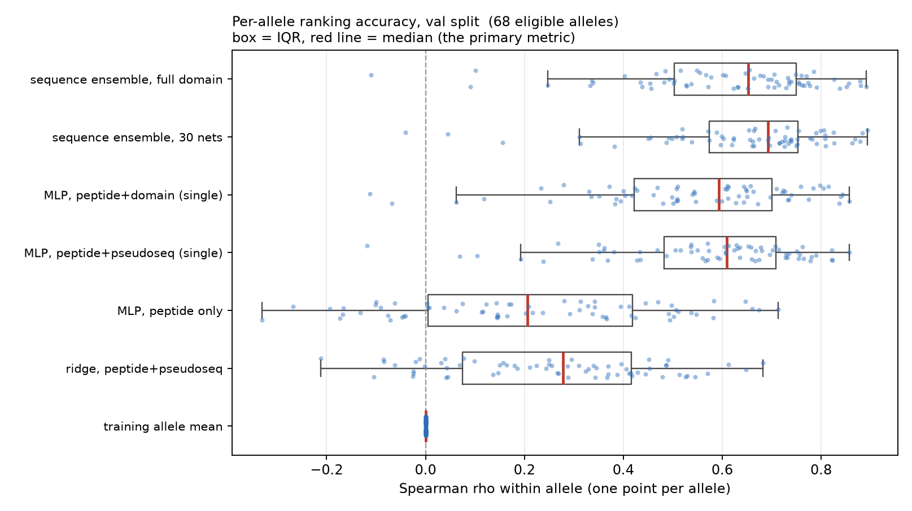

# Does pretrained protein AI predict peptide–HLA stability better than a cheap baseline?

**London AI × Science — Protein Engineering Track, 3–4 October 2026**
Predicting peptide–HLA dissociation half-life.

> **One-line result.** A small supervised model trained on raw sequences
> (median per-allele Spearman **0.693**) is the best approach we found. Frozen
> language-model embeddings, predicted 3D structures, inverse-folding scores, and
> empirical energy functions each **failed to beat it** under a pre-registered
> bar — and the structural arm is measurably worse. We report this as a
> well-supported negative, with uncertainty intervals, compute costs, and an
> external-validation check (AUROC 0.966) confirming the model learned real
> biology.

*All headline numbers below are **validation**. The held-out test set is scored
once, last, under a single-pass rule fixed in writing before any test number
existed; that pass is in progress (see §7).*

---

## 1. The problem, in plain terms

HLA molecules sit on the surface of our cells holding up short protein fragments
— here, **9-residue peptides** — so the immune system can inspect them. How long
a peptide stays stuck to its HLA (its **dissociation half-life**, or residence
time) matters for whether an immune response is triggered.

This is *not* the same as binding affinity (how readily it binds in the first
place): a peptide can bind tightly yet fall off quickly, or vice versa. So a
confident-looking predicted structure or a favourable energy score does not
automatically mean a long half-life. We test each of these as a *candidate
predictor* of the measured half-life.

**The research question.** Do **pretrained protein-AI features** — language-model
embeddings, predicted 3D geometry and confidence, energy scores — predict
half-life **better than a cheap model trained directly on the sequences**, and is
any improvement worth the compute cost?

## 2. Data and the rules we fixed in advance

| Property | Value |
|---|---:|
| Peptide–HLA pairs | 28,166 |
| Unique peptides | 5,633 |
| HLA alleles | 75 |
| Peptide length | 9 residues (exact) |
| Labels at exactly 0 h | 20.2% (an assay detection floor, not a true zero) |

**Splits.** Frozen 70/10/20, with peptides grouped by sequence similarity so that
no peptide within 3 substitutions of another appears in two different splits.
This stops a model from being graded on near-copies of its own training data —
the most common way a benchmark like this silently inflates.

**Primary metric.** *Median per-allele Spearman* — how well the model ranks
peptides **within** each HLA allele. (Ranking within an allele is the practically
useful question; it also avoids rewarding a model for merely knowing that some
alleles hold peptides longer than others.) We also track MAE on log-half-life and
precision@10.

**The bar, set before any modelling.** A gain counts as worthwhile only if it
clears **Δ median per-allele Spearman = 0.05**. This is not a preference — it is
derived from the test set's own statistical power: below ~0.05 this benchmark
cannot distinguish a real difference from noise. An interval that crosses zero is
*inconclusive*; a strong negative *rules out* 0.05.

**Fair-comparison rules.** Every arm uses the same rows, the same 30-network
ensembling, and an equal tuning *budget* (not transplanted tuning values — doing
that once cost the language-model arm 0.1 Spearman and nearly manufactured a
false negative). NetMHCstabpan, the published model for this task, is **not** used
as a comparator: it was trained on our entire dataset, including our test
peptides, so any score it posts on our data is memorisation.

## 3. Main result: pretrained features vs. the baseline

All numbers are validation median per-allele Spearman. Higher is better; the best
model is the sequence ensemble at 0.693.

| Approach | Score | Verdict vs. baseline (0.693) |
|---|---:|---|
| Allele-mean (sanity floor) | 0.000 | — |
| Single sequence MLP (peptide + HLA contact residues) | 0.610 | reference point |
| **Sequence ensemble (30 networks)** | **0.693** | **best in project** |
| ESM-2 35M embeddings, alone | 0.683 | no gain; rules out 0.05 |
| ESM-2 150M embeddings, alone | 0.674 | no gain |
| ESM-2 + sequence features | 0.676 | no gain |
| Boltz-2 structure — geometry only | 0.268 | far worse |
| Boltz-2 structure — confidence only | 0.393 | far worse |
| Boltz-2 structure — seq + geometry + confidence | 0.622 | **worse: −0.071 [−0.123, −0.025]** |
| FoldX energy + sequence | — | no gain (worse in cross-validation) |

**How to read this.**

- **The structural arm is conclusively worse.** Its confidence interval sits
  entirely below zero, and a sequence-only control run through the *identical*
  pipeline beats it at every tuning setting — so the loss is the structural
  features, not the fit.
- **The ESM-2 arms are inconclusive at zero.** They neither replace nor improve
  the baseline, and the intervals are tight enough to rule out a worthwhile gain.
- **We do not claim "pretraining helps."** ESM-2 only *ties* the cheap 34-residue
  contact-sequence baseline. Both beat a weaker full-domain encoding by similar
  margins — that is a fact about the weak encoding, not evidence for pretraining.

## 4. Secondary experiments (all validation)

| Experiment | Outcome |
|---|---|
| **Weak-binder augmentation** (stage 2b) | Negative. Best arm +0.024; all intervals exclude 0.05. Two negative sources, two weights, three seeds. |
| **Auxiliary affinity labels** (stage 2c) | Negative and *bounded*: the affinity signal is redundant, not absent (affinity alone ranks stability at ρ 0.580, below what the labels already give). |
| **ESM-2 + affinity** (stage 3b) | **Unresolved** — the measurement's own power straddles the 0.05 bar, so we report it as "could not resolve," not as a null. Flagged honestly. |
| **Censored (Tobit) loss** for the 20% floor (stage 7a) | Improves calibration as predicted but **loses on ranking**: Δ −0.0414 [−0.078, −0.006]. The frozen `log1p` baseline stands. |
| **ProteinMPNN inverse folding** (stage 5) | Not a half-life predictor. Repurposed as a crystal-free detector of a *bad predicted pose* — but rests on a single failing complex (n = 1), stated wherever quoted. |
| **FoldX empirical energy** (stage 8) | Adds nothing over the baseline. Side-finding: raw Boltz-2 side chains are strained and must be repaired before FoldX gives sane energies. |

Three separate extractions from the same predicted structures (geometry/confidence,
inverse-folding likelihood, and FoldX energy) all fail to add signal over the
sequence model — a consistent and mutually reinforcing picture, not a single
unlucky arm.

## 5. The strong positive results

**Elution as external validation (stage 3c).** With *no retraining*, the sequence
model was asked to rank 81,600 naturally-presented peptides (identified by mass
spectrometry) above 816,000 length- and allele-matched decoys — a different assay
measuring a different biological event. It reaches **median AUROC 0.9656**, while
random scores through the same code return chance. This is our strongest evidence
that the model learned genuine binding/stability biology rather than dataset
artefacts.

**New-allele headroom (stage 7b).** Holding out whole alleles, the model ranks
well for alleles similar to training ones (ρ 0.741) and poorly for distant ones
(ρ 0.339), a gap of +0.403. Real headroom exists for unseen alleles — though this
is partly confounded by distant alleles having intrinsically harder data.
Reported under its own separate evaluation contract and never quoted beside the
main numbers.

## 6. What it cost

| Approach | Cloud spend | Inference cost | Accuracy gain |
|---|---:|---|---|
| Sequence baseline | **$0** (CPU) | < 1 ms / 1,000 preds | — (the reference) |
| ESM-2 embeddings | ~$0 (cached) | ~$0.0005 / 1,000 preds | none measurable |
| Boltz-2 structures | **$212.71** | 28,166 folds, 0 failures, 7 h 32 min | none (worse) |
| FoldX energies | ~$0.33 (pilots) | full pass bounded before spending | none |

Total cloud spend across the project was **~$218**, dominated by the structural
fold — which, having been run cleanly end to end with zero failures, delivered
**no predictive gain over a free baseline**. That negative-with-a-price-tag is
itself a reportable result: it quantifies what the expensive path *costs* to rule
out.

## 7. Final test scoring (status)

Every number above is validation. The held-out **test set is scored once, last**,
to prevent the test set from influencing any modelling decision. Test predictions
for all five arms were generated (12:56–13:14 BST); the single-pass scoring is
running now, with a reproduction guard that refused to proceed when one arm failed
to reproduce bit-for-bit — the leakage discipline working as designed.

> **Test results: _pending single-pass completion_.** They will be dropped into
> §3 on arrival. If the pass does not complete before the deadline, this study
> stands as a validation-only result — which the project's own rules permit,
> provided it is labelled as such (it is).

## 8. Limitations we state up front

- **Scope of the negative.** It covers *frozen* ESM-2 embeddings (35M/150M) of
  peptide and HLA taken separately, Boltz-2 single-pose structures, and FoldX
  energies — not fine-tuning, not a chimeric peptide-in-groove input, not other
  model families. A null result bounds to what was tested.
- **One unresolved arm.** Stage 3b (ESM-2 + affinity) could not be resolved at the
  0.05 bar; we do not present it as a clean null.
- **The 20% assay floor** is a detection limit, not a measurement, which is why we
  lead with rank metrics and treat error-at-the-floor cautiously.
- **The assay panel was partly selected by predicted affinity**, so broader
  biological or clinical claims would need additional data.

## 9. Conclusion

For predicting peptide–HLA residence time on this dataset, a **cheap supervised
sequence model is the right tool**. Expensive pretrained features — language-model
embeddings, predicted structure, inverse-folding scores, and energy functions —
**do not beat it** under a pre-registered bar, and the structural path is
measurably worse at a real dollar cost. The result is delivered with uncertainty
intervals on every claim, full cost accounting, coverage of all three model
classes the brief names, and an external-validation AUROC of 0.966 confirming the
baseline learned real biology.

A well-supported negative, with its boundaries honestly drawn, is a successful
answer to the question posed — and a useful one: it tells the next team which
expensive paths not to re-walk, and what they would pay to try.

---

### Where the detail lives

Per-stage reports in `reports/` (audit, stage2–stage8), the frozen evaluation
contract in `EVALUATION.md`, the full compute ledger in
`reports/compute_ledger.md`, and reproducible code in `pepstab/` + `scripts/`.
The exhaustive long-form write-up is `reports/SUBMISSION.md`; this report is the
concise front door.
